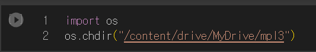

# Inha-ML-Term-Project

## Introduction

본 프로젝트는 [허영범](https://sites.google.com/inha.ac.kr/orail/home?authuser=0) 교수님의 고급기계학습 수업과정에서 진행한 Term Project 입니다. 인하대학교 산업경영공학과에 재학 중인 [배기웅](https://keywoongbae.github.io/), 홍상호, 공준식, 김수형이 진행하였습니다.

**핵심 문제** : CNN계열 딥러닝 모델을 이용해서 CIFAR-10 데이터 분류하기
**Extra Credit 문제** : 훈련된 모델로 추론시 해당 이미지와 가장 비슷한 (이미지 유사도가 가까운) 이미지 여러 개 (10개) 보여주는 기능 추가

본 프로젝트에서 사용한 모델/기법은 다음과 같습니다. 

| 딥러닝 기법 | 모델/논문 이름                                               |
| :---------- | ------------------------------------------------------------ |
| 지도학습    | [ResNet](https://openaccess.thecvf.com/content_cvpr_2016/html/He_Deep_Residual_Learning_CVPR_2016_paper.html) |
|             | [DRN](https://openaccess.thecvf.com/content_cvpr_2017/html/Yu_Dilated_Residual_Networks_CVPR_2017_paper.html) |
|             | [EfficientNet](http://proceedings.mlr.press/v97/tan19a.html) |
| 비지도학습  | [Deep Convolutional GAN(DCGAN)](Unsupervised Representation Learning with Deep Convolutional Generative Adversarial Networks) |
|             | [Diffusion Generative Model(DDPM)](https://proceedings.neurips.cc/paper/2020/hash/4c5bcfec8584af0d967f1ab10179ca4b-Abstract.html) |
| 준지도학습  | [Meta Pseudo Labels](https://openaccess.thecvf.com/content/CVPR2021/html/Pham_Meta_Pseudo_Labels_CVPR_2021_paper.html) |


## DDPM 실행 가이드

>  컴퓨터 스펙 : NVIDIA RTX A5000 D6 24GB

1. setup.ipynb 를 클릭합니다.
2. `! python train.py --dataset cifar10 --train-device cuda:0 --epochs 50` 를 입력하고 실행합니다.


## 준지도 mpl 모델 가이드

MPL-pytorch-main 폴더에 있는  7개의 파일[.gitignore , augmentation, data, main, models, README, utils] 를 구글 colab에 폴더(ex. mpl3)을 만들어서 다음과 같이 upload해줍니다.


그런 다음 ipynb 파일 하나를 만듭니다.(ex. mpl-pytorch_3만번.ipynb) 

구글 코랩에서 다음과 같은 코드를 실행하여 google dirve에 mount해줍니다.


그 다음 os를 import하여 위에서 7개의 파일을 업로드 했던 drive안의 폴더(ex. drive 안에 MyDrive안에 mpl3 폴더)에 연결합니다.



그 다음 밑의 코드를 실행시켜 학습을 시작합니다.

 ```python
 !python main.py \
 
   --seed 2 \
 
   --name cifar10-4K.2 \
 
   --expand-labels \
 
   --dataset cifar10 \
 
   --num-classes 10 \
 
   --num-labeled 4000 \
 
   --total-steps 30000 \
 
   --eval-step 1000 \
 
   --randaug 2 16 \
 
   --batch-size 128 \
 
   --teacher_lr 0.05 \
 
   --student_lr 0.05 \
 
   --weight-decay 5e-4 \
 
   --ema 0.995 \
 
   --nesterov \
 
   --mu 7 \
 
   --label-smoothing 0.15 \
 
   --temperature 0.7 \
 
   --threshold 0.6 \
 
   --lambda-u 8 \
 
   --warmup-steps 5000 \
 
   --uda-steps 5000 \
 
   --student-wait-steps 3000 \
 
   --teacher-dropout 0.2 \
 
   --student-dropout 0.2 \
 
   --finetune-epochs 625 \
 
   --finetune-batch-size 512 \
 
   --finetune-lr 3e-5 \
 
   --finetune-weight-decay 0 \
 
   --finetune-momentum 0.9 \
 
   --amp
 ```

 


 

그럼 코드가 다음과 같이 실행될 것입니다.


 

코드가 다 실행되고 finetune 까지 마쳤다면 다음과 같은 코드를 실행하여 tensorboard를 colab에서 실행시켜 결과를 그래프로 볼 수 있습니다.


여기서 –logdir 뒤에는 colab 폴더(mpl3) 안에 학습을 하면서 evaluation 했던 결과값이 저장된 폴더명(ex. results)이 들어가야 합니다.


 

 

Requirements

- python 3.6+
- torch 1.7+
- torchvision 0.8+
- tensorboard
- wandb
- numpy
- tqdm

 

참고했던 github 주소 :

https://github.com/kekmodel/MPL-pytorch

• MPL-pytorch-main 폴더를 여기에서 다운 받으실 수도 있습니다.

 

colab 폴더(mpl3) 공유 주소 :

https://drive.google.com/drive/folders/12zMWYMr5LFtAKPLHtuL_ppVM3nn-lXWM?usp=sharing

 

colab 실행 파일 공유 주소 :

https://colab.research.google.com/drive/15JvJ78LVMJM6Th1v4LMofbf_pqsACoLm?usp=sharing

 
